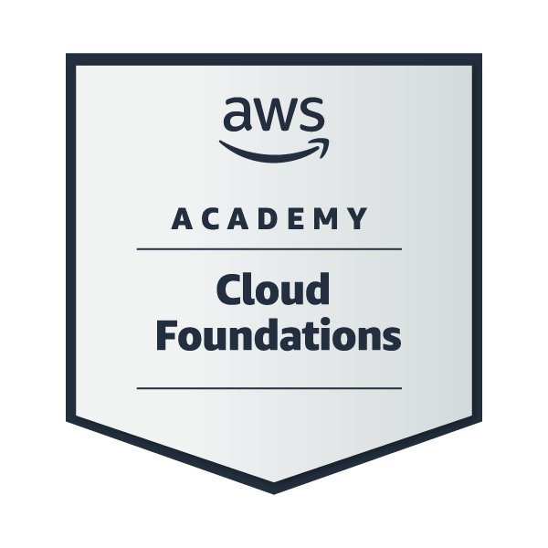
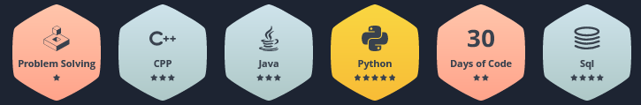

<h1 align="center">Hi there! This is Ravin!</h1>
<h3 align="center">CS undergrad and a passionate AI + MLOps Engineer</h3>

  

  

  

 
 

🔭 I’m currently working on **Space Science Projects with Reputed Space organizations along with Deep Learning and Backend Development**

🌱 I’m currently exploring **Front End Technologies and AI**

💬 Ask me about **Machine Learning and Backend Technologies**

🔥 Fact about me **I'd love to create stuffs which solves real life problems** 

📫 How to reach me **ravin.d3107@outlook.com**

 
 

<h3 align="center">Connect with me:</h3>

 
 
<h3>HacktoberFest Badges (Opensource Contributions)</h3>

   
<h3>Microsoft Learn Badges</h3>

<h3>Google Badges</h3>

<h3>AWS Badges</h3>

<h3>Hackerrank Badges</h3>

<h3 align="center">Packages and Libraries (For ML, DL and CV)</h3>

     

<h3>Programming Languages and Tools</h3>

 

 
   

<h3>Overall Statistics</h3>

<a href="https://github.com/ravin-d27">

