# Ravin D - The Code Artist

<div align="center">

### `Full Stack Dev` • `ML Engineer` • `System Designer` • `Open Source Enthusiast`


[](https://github.com/ravin-d-27)
[](https://github.com/ravin-d-27)

</div>

---

## Quick Stats & Highlights

<div align="center">

| **Focus Areas** | **Current Vibe** | **Next Level** |
|:------------------:|:--------------------:|:------------------:|
| Full Stack Development | Building Agentic AI systems | AI/ML Integration |
| LLM Fine Tuning | Deep Learning models | System Architecture |
| Data Engineering | Cloud-native solutions | Open Source Impact |

</div>

<div align="center">

  
</div>

---

## Tech Arsenal

<details>
<summary><strong>Core Languages</strong> (Click to expand)</summary>
<br>

```python
languages = {
    "expert": ["Python", "JavaScript", "Java", "C#"],
    "proficient": ["SQL", "HTML/CSS", "TypeScript"],
    "experience_years": "5+",
    "lines_of_code": "100,000+"
}
```

<div align="center">
  
</div>

</details>

<details>
<summary><strong>Frameworks & Libraries</strong> (The Real MVPs)</summary>
<br>

### Backend Powerhouse
<div align="center">
  
</div>

### Frontend Magic
<div align="center">
  
</div>

### AI/ML Toolkit
<div align="center">
  
  <br>
  
  
  
</div>

</details>

<details>
<summary><strong>Cloud & DevOps</strong> (Scaling to Infinity)</summary>
<br>

<div align="center">
  
</div>

**Deployment Philosophy:** `Code → Test → Deploy → Scale → Repeat`

</details>

<details>
<summary><strong>Databases & Analytics</strong> (Data is the New Oil)</summary>
<br>

<div align="center">
  
</div>

**Analytics Stack:** PowerBI • Tableau • Advanced SQL • ETL Pipelines

</details>

---

## Specializations

```mermaid
graph TD
    A[Ravin's Tech Universe] --> B[Full Stack Development]
    A --> C[AI/ML Engineering]
    A --> D[Data Engineering]
    A --> E[🏗System Architecture]
    
    B --> B1[React/Next.js Frontend]
    B --> B2[Django/FastAPI Backend]
    B --> B3[RESTful API Design]
    
    C --> C1[LLM Fine Tuning]
    C --> C2[Deep Learning Models]
    C --> C3[Computer Vision]
    
    D --> D1[ETL Pipelines]
    D --> D2[Data Mining]
    D --> D3[Real-time Analytics]
    
    E --> E1[Microservices]
    E --> E2[Cloud Architecture]
    E --> E3[Performance Optimization]
```

<div align="center">



</div>

---

## Achievement Gallery

<div align="center">

[](https://github.com/ryo-ma/github-profile-trophy)

</div>

### Certifications & Badges

<div align="center">

**Microsoft Learn** • **Google Cloud** • **AWS Academy Graduate** • **HackerRank Problem Solver**

[](https://holopin.io/@ravind2704)
</div>

---

## GitHub Analytics

<div align="center">
  
</div>

<div align="center">
  
</div>

<div align="center">
  
  
</div>

---

## Let's Connect & Build Something Epic

<div align="center">

[](https://twitter.com/Ravin_D27)
[](https://linkedin.com/in/ravin-d-035922216)
[](https://kaggle.com/ravin2704)
[](https://www.codechef.com/users/ravin_3107)
[](https://www.hackerrank.com/ravin_d3107)

### Fuel My Code Addiction

[](https://www.buymeacoffee.com/ravind27)

</div>

---

<div align="center">

### Developer Philosophy

> *"Code is poetry written in logic, debugged with patience, and deployed with hope."*

**Currently:** Building the next generation of AI-powered applications  
**Always:** Learning, coding, and pushing the boundaries of what's possible  
**Goal:** Making technology more accessible and impactful for everyone  

---


</div>
